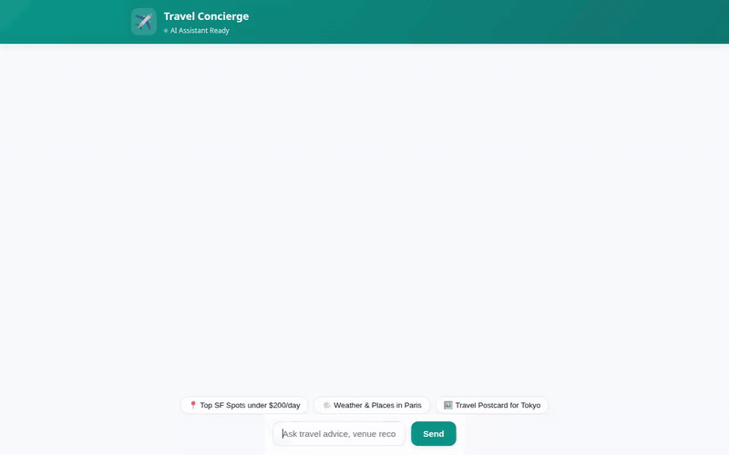

# ✈️ Travel Concierge

An intelligent, multi-modal AI travel assistant built with the **Google Agent Development Kit (ADK)**, powered by **Gemini**, and deployed to **Google Cloud Platform (GCP)**. Travel Concierge assists users with trip planning, destination discovery, live currency conversions, weather updates, real-time place searches, and AI-generated visual media (images & videos), all while preserving long-term memory across sessions.



---

## 🌟 Capabilities & Features

All features listed below are fully implemented and wired in `app/agent.py` and `frontend/`:

* 🧠 **Cross-Session Preference Memory (Vertex AI Memory Bank)**  
  Persists user preferences, dietary restrictions, health conditions, and travel styles across conversations using Vertex AI Memory Bank and ADK `PreloadMemoryTool`.

* 🗄️ **Destination Catalog Management (Google Cloud Firestore)**  
  Stores and queries curated travel destinations (`destinations` collection) with support for listing, detailed lookups, and adding new destinations dynamically.

* 🪣 **Media Asset Storage (Google Cloud Storage)**  
  Uploads generated destination images and videos directly to a public GCS bucket (`gs://travel-concierge-images-...`) and returns public HTTPS URLs.

* 🎨 **Destination Image Generation (Imagen / Gemini Flash Image)**  
  Generates high-quality travel destination photos (`gemini-3.1-flash-lite-image`) in the `global` region, saving them to ADK Playground Artifacts and GCS.

* 🎬 **Cinematic Video Generation (Gemini Omni)**  
  Generates short travel preview videos using Google's **Gemini Omni** model (`gemini-omni-flash-preview`) in the `global` region, returning public GCS URLs and saving Playground artifacts via `tool_context.save_artifact`.

* 📍 **Live Location Discovery (Google Places API & Geocoding)**  
  Geocodes addresses and searches nearby attractions, hotels, and restaurants using Google Maps Geocoding and Google Places API (v1).

* 🧮 **Code Execution Sandbox**  
  Uses Python code execution (`BuiltinCodeExecutor`) for accurate budget math, expense splitting, and trip calculations.

* 💱 **Real-Time Foreign Exchange Rates**  
  Fetches live currency conversion rates using the Frankfurter REST API.

* ☀️ **Weather & Local Time Lookup**  
  Retrieves real-time weather forecasts via Open-Meteo REST API and accurate local time zone information using Python `ZoneInfo`.

* 📱 **A2UI Protocol Surface Rendering**  
  Emits v0.8 Basic Catalog structured UI cards (`Card`, `Column`, `Row`, `Text`, `Image`) rendered directly inside both ADK Web and the custom frontend.

* 💻 **Polished Web Frontend & FastAPI Proxy**  
  Single-page web chat application (`frontend/`) talking A2A protocol to the deployed Agent Engine runtime, featuring Teal theme styling, category prompt chips, typing animations, session reset, and copy-to-clipboard support.

---

## 🚧 Planned / Not Yet Implemented

* ✈️ *Live Flight Booking Integration* (Planned for v2.0)  
* 🏨 *Direct Hotel Reservation & Payment Gateway* (Planned for v2.0)

---

## 🏗️ Project Architecture

```
travel-concierge/
├── app/                        # Core Agent Engine logic
│   ├── agent.py                # Tools, memory callbacks, A2UI instructions, Agent definition
│   └── a2ui_utils.py           # A2UI response formatting & callbacks
├── frontend/                   # Custom FastAPI Chat Web Frontend
│   ├── main.py                 # FastAPI proxy connecting browser to Agent Engine over A2A
│   ├── static/
│   │   └── index.html          # Web UI layout, category chips, A2UI card renderer
│   ├── Dockerfile              # Container spec for Cloud Run deployment
│   └── requirements.txt        # Frontend proxy dependencies
├── agents-cli-manifest.yaml    # Agents CLI project & deployment metadata
├── demo.gif                    # Inline animated demo recording
└── pyproject.toml              # Python project configuration & dependencies
```

---

## 🚀 Local Setup & Development

### 1. Prerequisites

- **Python 3.11+**
- **Google Cloud SDK (`gcloud`)** authenticated with active project permissions
- **`agents-cli`** (`uv tool install google-agents-cli`)

### 2. Installation

Clone the repository and install dependencies:

```bash
git clone <your-repo-url>
cd travel-concierge
pip install -r pyproject.toml
```

### 3. Run Locally in ADK Playground

Launch the local development environment:

```bash
agents-cli playground
```

Open the ADK Web UI at the local port printed in your terminal.

---

## 🌐 Running the Web Frontend Locally

To run the custom FastAPI chat web UI locally:

1. Navigate to the `frontend` directory:
   ```bash
   cd frontend
   pip install -r requirements.txt
   ```

2. Set required environment variables:
   ```bash
   export AGENT_ENGINE_RESOURCE_NAME="projects/<PROJECT_NUMBER>/locations/us-east1/reasoningEngines/<REASONING_ENGINE_ID>"
   export AGENT_DIRECTORY="app"
   ```

3. Start the FastAPI proxy server:
   ```bash
   python main.py
   ```

4. Open your browser and navigate to port `8080` on localhost.

---

## ☁️ Deployment

### Agent Engine Deployment

Deploy the agent logic to GCP Agent Engine Runtime:

```bash
agents-cli deploy
```

### Cloud Run Frontend Deployment

Deploy the web frontend container to Cloud Run:

```bash
cd frontend
gcloud run deploy travel-concierge-frontend \
  --source . \
  --region us-east1 \
  --set-env-vars AGENT_ENGINE_RESOURCE_NAME="<YOUR_AGENT_RESOURCE_NAME>",AGENT_DIRECTORY="app" \
  --allow-unauthenticated
```
